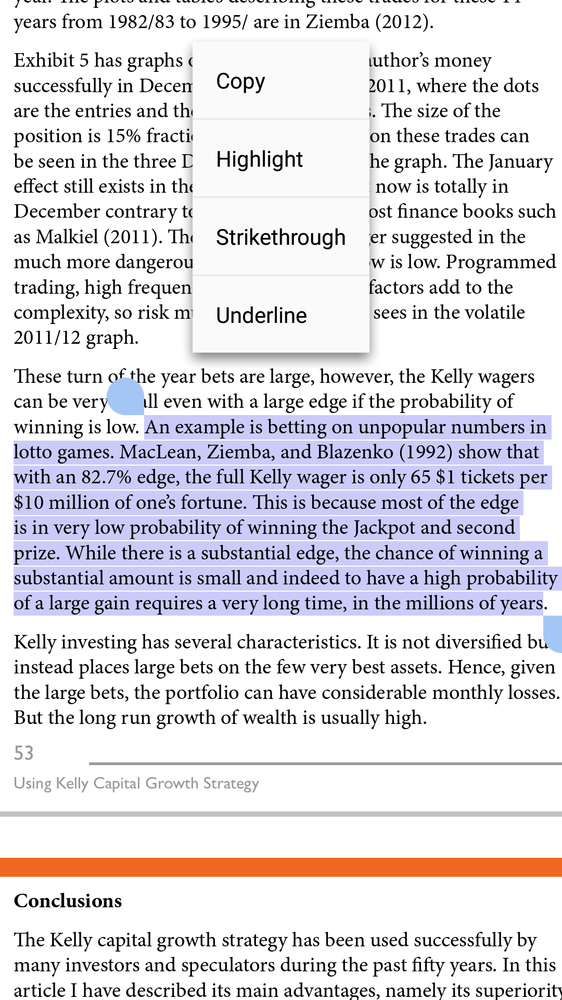

# 介绍

彩票市场在中国内地甚至全球的市场占有份额日益增加，越来越多赌徒热爱购买彩票。今天僕尝试分析随机内地彩票---**福彩3D**为数据，分析是否可能从中获利。

**美国马萨诸塞州 Cash Winfall 彩票有漏洞!**文献中阐述：

> Cash Winfall彩票有一条特殊的规则：当头奖达到200万美元而无人领取后，较小的奖项奖金金额将会变大，比如末奖能从5美元增加到几十美元。统计学家称，任何人只要购买10万美元以上的彩票就要保证盈利。因此每隔几个月，当头奖金额累积到200万美元后，由精明的赌徒组成的小团体就会短暂控制整个博彩，他们有的来自MIT，有的来自东北大学，训练有素，他们会投入数十万美元购买彩票，每次能获得几十万美元的收入，这些盈利还没有计算获得头奖的可能性。麻州的博彩官员正开始采取行动限制大量购买，比如每个彩票点每天只能出售5000美元的彩票...


## 环境设置

环境设置与读取程序包。

```{r setup, message=FALSE}
## Remove all objects (includes hidden objects).
rm(list = ls(all = TRUE))
options(warn = -1) #Do not display warning messages.

suppressPackageStartupMessages(library('BBmisc'))
pkgs <- c('devtools', 'knitr', 'kableExtra', 'rvest', 'plyr', 'dplyr', 'magrittr', 'stringr', 'lubridate', 'devtools', 'openxlsx', 'DT', 'mvtnorm', 'PoisNor', 'flexmix', 'poilog', 'kfoots', 'mvrpois', 'rstan', 'matrixStats')

##https://github.com/lamortenera/kfoots
#'@ suppressAll(library('kfoots')) ##Fit mixture model or a hidden markov model

suppressAll(lib(pkgs))
rm(pkgs)

## Modified or call hidden functions in mvrpois.
l_ply(dir(paste0(getwd(), '/function/')), function(funs) source(paste0(getwd(), '/function/', funs)))#, local = TRUE))
```

# 读取数据

[福彩3D: 直选走势](http://sports.sina.com.cn/l/tubiao/3d_jibenzoushitu.html)数据从*2016158期*至*2017158期*，一共有360个观测数据。该福彩类型规则乃预测3个随机数字，从000至999。

```{r read-data}
## 
## http://baidu.lecai.com/lottery/draw/list/52?type=latest&num=100 ##要下载txt或xlsx文件，需要登入账户
#'@ read_html('http://sports.sina.com.cn/l/tubiao/3d_jibenzoushitu.html') %>% html('table_A')

## http://zst.sina.aicai.com/gaopin_cqssc/?sDate=&eDate=&q=t100&sortTag=up ##时时彩上至五个随机变量，比福彩3D复杂

## http://sports.sina.com.cn/l/tubiao/3d_jibenzoushitu.html ## 快三

ltry_data <- read.xlsx(xlsxFile = './data/lottery_data.xlsx', detectDates = TRUE) %>% .[1:5] %>% tbl_df %>% mutate(Result = as.numeric(paste0(Result1, Result2, Result3)))

datatable(ltry_data)
```

*数据图2.1：福彩3D开彩数据*

  从以上数据图2.1，首先僕绘制个频率图。

```{r plot-1}
##观测数据量
length(ltry_data$Result)

##过滤重复开彩成绩
length(unique(ltry_data$Result))

hist(ltry_data$Result, main = "3D Lottery Histogram", xlab = "Number (Digit from 0 to 999)")
```

*数据图2.2：福彩3D开彩数据频率图*

  以 000 至 999 三位数随机变量，一般上会以普通频率分布分析，然而由于三位数字非出现在同一个单位（slot）里而是个别三个随机变量，因此*多变量泊松模式*将能分析。

# 数学模式

- `kfoots`：[kfoots](https://github.com/lamortenera/kfoots)程序包使用马克夫链，举例此期开彩010，该模式将分析及预测每当开彩该成绩后的下一个成绩（状态的转换率）的机率
- `PoisNor`：[PoisNor](https://cran.r-project.org/package=PoisNor)程序包提供多随机变量产生器及相关系数分析
- `poilog`：[poilog](https://cran.r-project.org/package=poilog)程序包分析双变量泊松模式
- `mvrpois`：[mvrpois](https://github.com/alekdimi/mvrpois)程序包分析多变量泊松模式

在此，僕使用`mvrpois`多变量泊松模式分析**仨变量泊松**3D彩票数据，有关详情请查阅*Dimitris Karlis and Loukia Meligkotsidou (2005)^[**7.3 参考文献**中的4th文献]*和*Dimitris Karlis (2002)^[**7.3 参考文献**中的3rd文献]*。

$$(X_{1},X_{2},X_{3})_{i} ~ 3 - Pois(\theta_{1i},\theta_{2i},\theta_{3i},\theta_{12i},\theta_{13i},\theta_{23i}) \dots equation\ 3.1$$

  - $log(\theta_{1i}) = \alpha_{1} + \beta_{1}z_{i}$
  - $log(\theta_{2i}) = \alpha_{2} + \beta_{2}z_{i}$
  - $log(\theta_{3i}) = \alpha_{3} + \beta_{3}z_{i}$
  - $log(\theta_{12i}) = \alpha_{4} + \beta_{4}z_{i}$
  - $log(\theta_{13i}) = \alpha_{5} + \beta_{5}z_{i}$
  - $log(\theta_{23i}) = \alpha_{6} + \beta_{6}z_{i}$

联合分布函数将为：

$$P(X = x) = \sum_{(y_{12},y_{13},y_{23})\in C}\frac{exp(-\sum\theta_{i})\theta_{1}^{x_{1}-y_{12}-y_{13}}\theta_{2}^{x_{2}-y_{12}-y_{23}}\theta_{3}^{x_{3}-y_{13}-y_{23}}\theta_{12}^{y_{12}}\theta_{13}^{y_{13}}\theta_{23}^{y_{23}}}{(x_{1}-y_{12}-y{13})!(x_{2}-y_{12}-y{23})!(x_{3}-y_{13}-y{23})!y_{12}!y_{13}!y_{23}!} \dots equation\ 3.2$$
  而 $C \subset N^3$ 设为： 

$$C = (y_{12},y_{13},y_{23}) \in N^3 : \{y_{12}+y_{13}\leq x_{1}\} \cup \{y_{12}+y_{23}\leq x_{2}\} \cup \{y_{13}+y_{23}\leq x_{3}\} \neq \theta$$

**Rerefences for multivariate Poisson models : **

- [Can a Multivariate Poisson Distribution be implemented in Stan?](https://groups.google.com/forum/#!topic/stan-users/3VHq_GxGWEw)
- [n-mixture model in Stan? marginalizing](https://groups.google.com/forum/#!newtopic/stan-users/stan-users/9mMsp1oB69g)
- [karlis-ntzoufras-reproduction/model.stan](https://github.com/Torvaney/karlis-ntzoufras-reproduction/blob/master/model.stan)
- [Reproductions of models for football (soccer) matches in Stan/PyStan](https://github.com/Torvaney/soccerstan)^[So far, the following models have been implemented:] ^[1) Maher (1982) - Modelling Association Football Scores - maher] ^[2) Dixon and Coles (1997) - Modelling Association Football Scores and Inefficiencies in the Football Betting Market - dixon-coles] ^[3)Karlis and Ntzoufras (2008) - Bayesian modelling of football outcomes (using the Skellam's distribution) - karlis-ntzoufras]

```{r trvPois, eval=FALSE}
## =========================== eval=FALSE ==============================
## get the trivariate sample data and convert to matric format.
m <- ltry_data %>% select(Result1, Result2, Result3) %>% as.matrix
#'@ m <- ltry_data %>% select(Date, Result1, Result2, Result3) %>% as.matrix
#'@ adply(m, 1, transform, mvp = mvp.fit(method = 'HMC'))

## ------------------------ PENDING --------------------------------------
## 1) missing files : 'karlis.stan' and 'karlis.covariates.stan'.
## 2) missing codes : cov() inside gibbs() inside mvp.fit.R
## ------------------------ PENDING --------------------------------------

## Hamiltonian Monte Carlo (HMC)
fit.HMC <- mvp.fit(m, method = 'HMC')

## Gibbs MCMC
fit.Gibbs <- mvp.fit(m, method = 'Gibbs')

## ==============================================================================
## 1) method = Monte Carlo samples, default iterations : n.mc = 10000.
tv.mc <- mvp.prob(m, seq(0, 9), logarithm = FALSE, method = 'MC')

adply(m, 1, transform, prob = mvp.prob(m[, c('Result1', 'Result2', 'Result3')], seq(0, 9), logarithm = FALSE, method = 'MC'))


## 2) method = 'recursive', but it is equal to 'analytical'.
tv.rc <- mvp.prob(m, seq(0, 9), logarithm = FALSE, method = 'recursive')

## 3) method = 'analytical', but it is equal to 'recursive'.
tv.an <- mvp.prob(m, seq(0, 9), logarithm = FALSE, method = 'analytical')


```


# 投注模式

**understanding the kelly capital growth investment strategy**文中提及，尽管中马票的机率非常渺茫，但是运用凯利模式长期投注的话还是可以获利，不过可能得花上百万年时间，请查看下图。



由于凯利投资模式，在此使用该模式。有关凯利模式投注，请参阅：
  
- [Application of Kelly Criterion model in Sportsbook Investment](https://github.com/scibrokes/kelly-criterion)
- [Job Application - Quantitative Analyst (binary.com)](https://github.com/englianhu/binary.com-interview-question)

```{r}


```

# 盈利

```{r}


```


# 结论

Summary of the betting

```{r}

```

```{r close-Opt}
options(warn = 0)
```

# 附录

## 文献明细

以下乃此文献资讯：

- 文件建立日期：2017-06-15
- 文件最新更新日期：`r today('Asia/Tokyo')`
- `r R.version.string`
- R语言版本：`r getRversion()`
- [**rmarkdown** 程序包](https://github.com/rstudio/rmarkdown)版本：`r packageVersion('rmarkdown')`
- 文件版本：1.0.1
- 作者简历：[®γσ, Eng Lian Hu](https://beta.rstudioconnect.com/content/3091/ryo-eng.html)
- GitHub：[源代码](https://github.com/englianhu/binary.com-interview-question)
- 其它系统资讯：

```{r info, echo=FALSE, warning = FALSE, results = 'asis'}
suppressMessages(require('dplyr', quietly = TRUE))
suppressMessages(require('formattable', quietly = TRUE))

sys1 <- devtools::session_info()$platform %>% unlist %>% data.frame(Category = names(.), session_info = .)
rownames(sys1) <- NULL

sys1 %<>% rbind(., data.frame(Category = 'Current time', session_info = paste(as.character(now('Asia/Tokyo')), 'JST')))

sys2 <- data.frame(Sys.info()) %>% mutate(Category = rownames(.)) %>% .[2:1]
names(sys2)[2] <- c('Sys.info')
rownames(sys2) <- NULL

cbind(sys1, sys2) %>% 
  kable(caption = 'Additional session information:') %>% 
  kable_styling(bootstrap_options = c('striped', 'hover', 'condensed', 'responsive'))

rm(sys1, sys2)
```

## 版本
  
  - 文献版本: 1.0.0 - *"2017-06-15 20:47:50 JST"*


## 参考文献

1. [**Bayesian Multivariate Poisson Regression for Models of Injury Count, by Severity** *by Jianming Ma and Kara M. Kockelman (2006)*](https://github.com/englianhu/lottery/tree/master/reference/Bayesian%20Multivariate%20Poisson%20Regression%20for%20Models%20of%20Injury%20Count%2C%20by%20Severity.pdf)
2. [**FlexMix - An R package for finite mixture modelling** *by Bettina Grun and Friedrich Leisch (2007)*](https://github.com/englianhu/lottery/tree/master/reference/FlexMix%20-%20An%20R%20package%20for%20finite%20mixture%20modelling.pdf)
3. [**Multivariate Poisson Models** *by Dimitris Karlis (2002)*](https://github.com/englianhu/lottery/tree/master/reference/Multivariate%20Poisson%20Models.pdf)
4. [**Multivariate Poisson Regression with Covariance Structure (Preview)** *by Dimitris Karlis and Loukia Meligkotsidou (2005)*](https://github.com/englianhu/lottery/tree/master/reference/Multivariate%20Poisson%20Regression%20with%20Covariance%20Structure%20(Preview).pdf)
5. [**Package 'poilog'** *by Vidar Grøtan and Steinar Engen (2015)*](https://github.com/englianhu/lottery/tree/master/reference/Package%20'poilog'.pdf)
6. [**Resampling Methods for Longitudinal Data Analysis** *by Yue Li (2005)*](https://github.com/englianhu/lottery/tree/master/reference/Resampling%20Methods%20for%20Longitudinal%20Data%20Analysis.pdf)
7. [**彩票的数学知识** *by 阮一峰 (2018)*](http://www.ruanyifeng.com/blog/2018/04/lottery-mathematics.html)
8. [**00后买彩票2个月疯狂吸金50万** *by 财经观察 (2018)*](http://www.tw294.cn/)
9. [Mass. Changes Rules To Cash WinFall Lottery After Easy Wins](https://www.huffingtonpost.com/2011/08/03/mass-changes-lottery-rules_n_916972.html)
10. [程阳：美国马萨诸塞州 Cash Winfall 彩票有漏洞! ](http://chengyangblog20.blog.163.com/blog/static/2108302022011771480468/)
11. [美国夫妇钻开奖漏洞 简单计算后的“必赢”结论](http://sports.sohu.com/20110806/n315531364.shtml)
12. [Understanding the Kelly Capital Growth Investment Strategy](https://github.com/scibrokes/kelly-criterion/blob/master/references/Understanding%20the%20Kelly%20Capital%20Growth%20Investment%20Strategy.pdf)
13. [數學家中14次樂透賺進9億元！　 美、澳因他被迫修法](https://www.ettoday.net/news/20180829/1246651.htm)
14. [樂透能偷吃步？ 經濟學家用這招中14次頭彩賺9億](https://udn.com/news/story/6810/3337660)

## 感言

---

**Powered by - Copyright® Intellectual Property Rights of  [Scibrokes®](http://www.scibrokes.com)**

